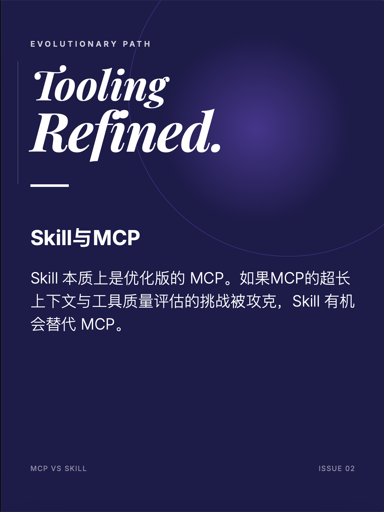
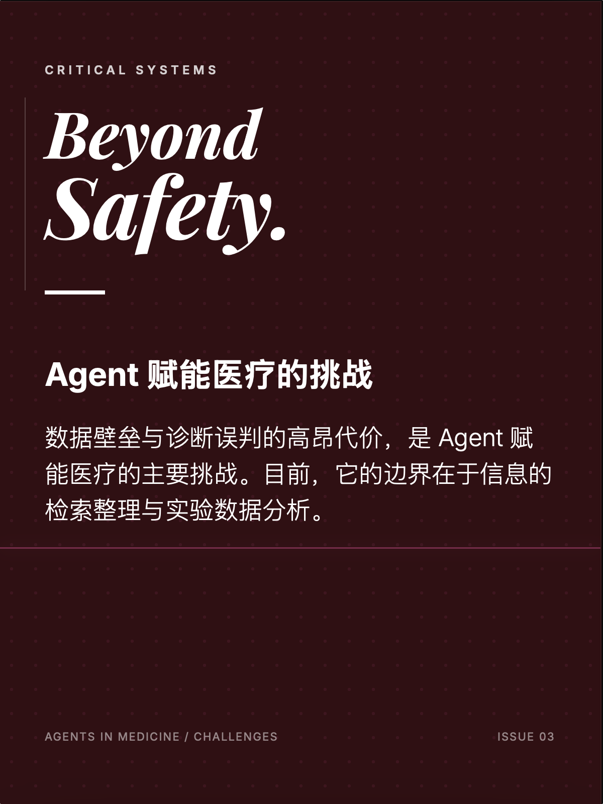
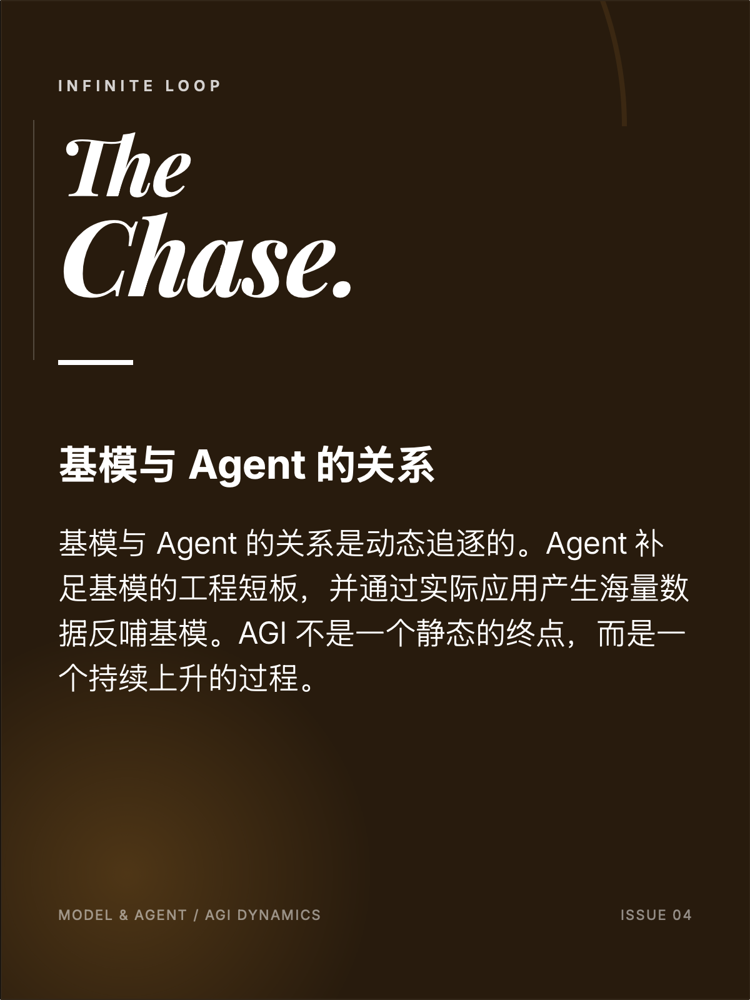

## ViMax uses transition video for spatial consistency control — is there a more effective, lower-cost approach?

Cutting costs and improving efficiency is an eternal theme. Effectiveness and cost are always a trade-off. To generate faster you use a smaller model, but accuracy drops; for accuracy you use a larger model, which costs more time.

## Why do we need Skill when MCP already exists? Will Skill replace MCP in the future?

Skill is built on MCP under the hood, so Skill can be seen as an optimized version of MCP.

MCP's challenge lies in very long context and evaluating tool quality. If these problems can be solved by Skill, then there is a chance Skill could replace MCP.

Professor Huang's recent work AnyTool mainly addresses MCP tool retrieval and tool quality detection.

## The challenges of Agents in healthcare

1. Data barriers
2. The cost of an Agent's wrong judgment is too high

What Agents can do is information retrieval and summarization — for example, answering how to maintain health or how to exercise — and analyzing experimental data.

## The relationship between base models and Agents

The relationship between base models and Agents is dynamic. An Agent should be able to do what a base model can't. For example, now that base models can write code, an Agent should be able to implement algorithms and test them. Because Agents operate in more complex, specific application scenarios, they correspondingly generate more data. That data can be used to train base models and improve their capabilities. AGI should be a goal that's always being pursued.

