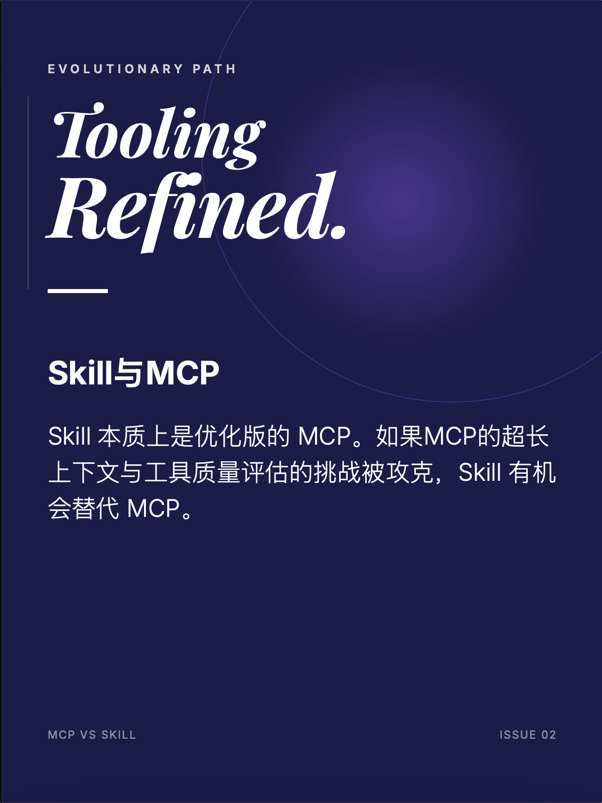
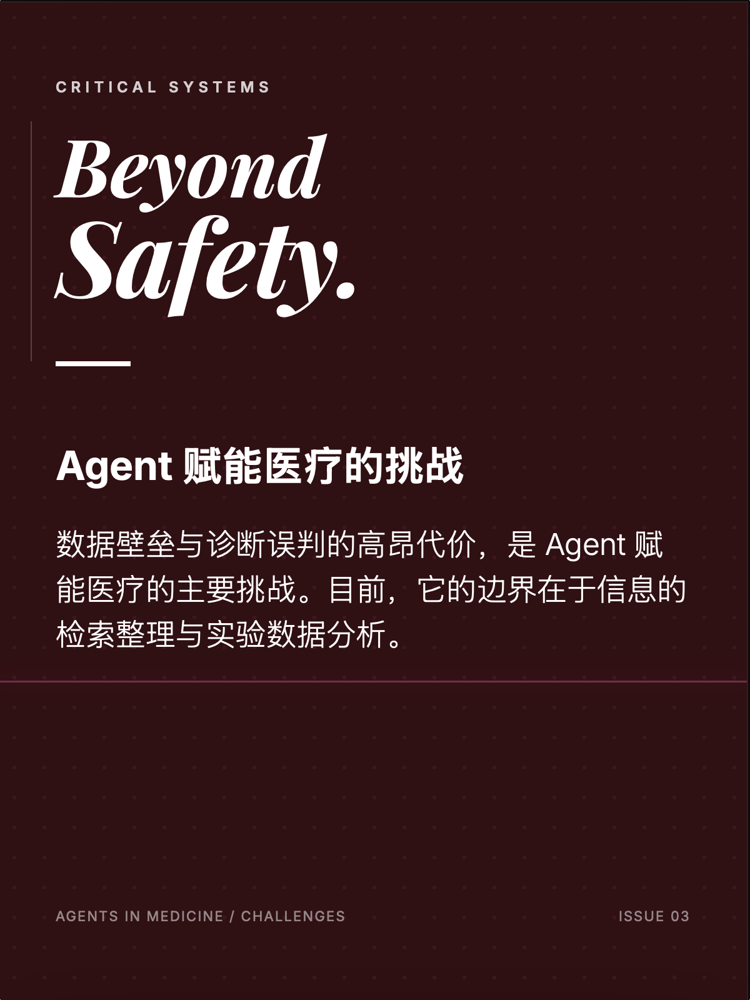
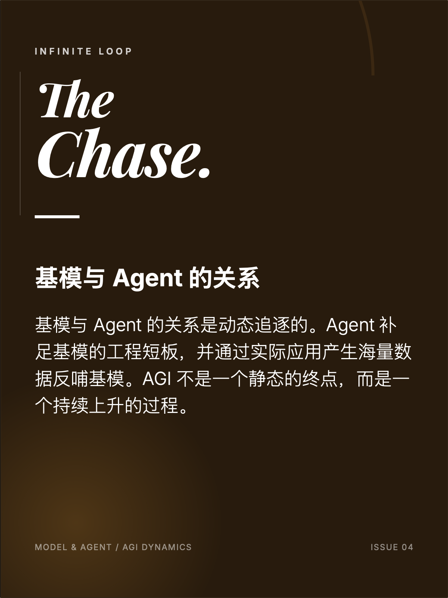

## ViMax用transition video做空间一致性控制，有更有效、更低成本的方案吗

降本增效是永恒的话题。有效和成本的方案一直是trade-off。为了生成更快会用小模型，但是准确性会下降，为了准确性使用大模型会导致时间成本更高。

## 为什么有了MCP还需要Skill，未来Skill会替代MCP吗？

Skill的底层也是MCP，Skill可以看成是优化版的MCP。

MCP的challenge在超长上下文和工具质量的评估。如果这些问题能够被Skill解决，那么Skill就有替代MCP的可能性。

黄老师最近的新工作AnyTool主要解决MCP工具检索，工具质量检测的问题。

## Agent赋能医疗的挑战

1. 数据壁垒
2. Agent的错误判断带来的代价太大

Agent能做的是信息检索和总结，比如回答如何养生，如何做运动；还有对实验数据的分析

## 基模和Agent的关系

基模和Agent之间的关系是动态的，Agent应该能做到基模做不到的事情。比如现在基模能够写代码，那么Agent就应该能够做到实现算法，测试算法。Agent因为有更复杂更具体的应用场景，相应的能够生成更多数据。这些数据可以用来训练基模，提高基模的能力。AGI应该是一个一直在追逐的目标。

