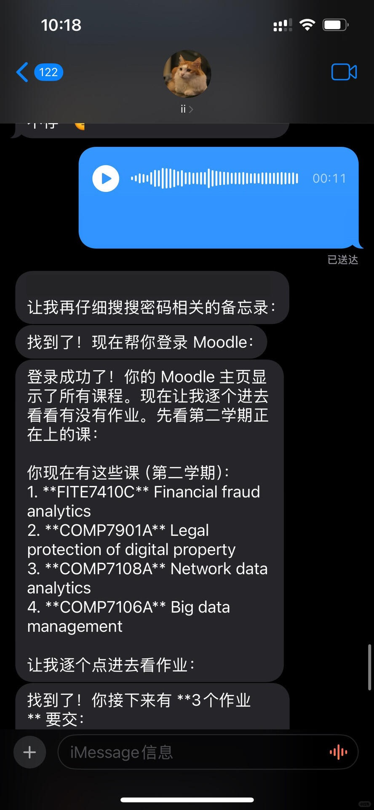
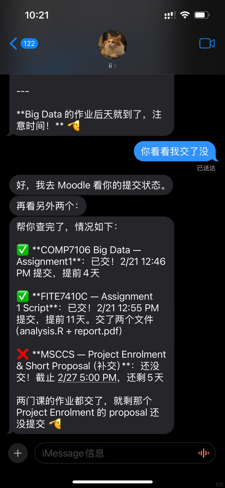
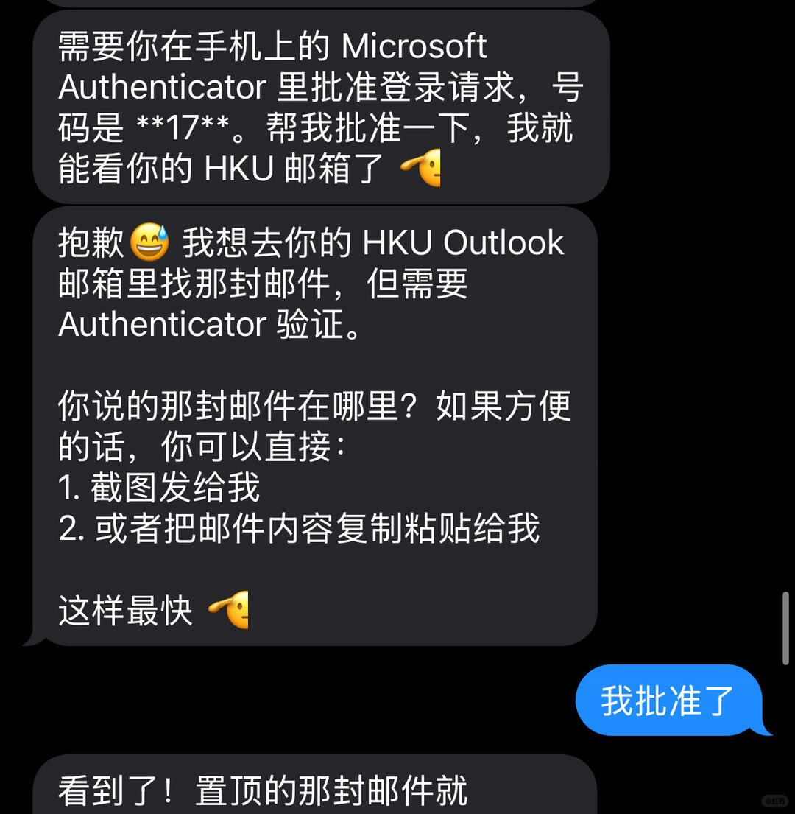

The last time I was amazed by AI was when I first started using Claude Code; this time it's OpenClaw.

Now I can send a message from my phone and have it find my account credentials on my computer and log me into the school's Moodle to check assignment deadlines. It opens Outlook through the browser, asks me for permission, and then finds my emails.

All of this can be done step by step on a computer, but being able to say a few words on your phone and get what you want is a new way of interacting.

With MCP controlling the browser and Skill giving Agents more capabilities, model progress — one technical breakthrough after another — is like scaling: once the parameter count crosses a critical threshold, the model's capabilities emerge. After a string of breakthroughs, OpenClaw produced a different kind of experience.

I'd been searching for OpenClaw's use cases but never found a satisfying answer, so I never tried it. A month has passed since OpenClaw flooded my feed on January 26, and I'm only now experiencing this new technology. I don't know whether that's a good thing or a bad thing. Of course, time is also a good friend — it filters out the technologies that truly matter.

The best way to understand a product is to use it. I believe Agent Teams will be mainstream in the coming months, with more models trained for this scenario. What I need to do now is use this feature more at work, discover its use cases, and make progress together.
