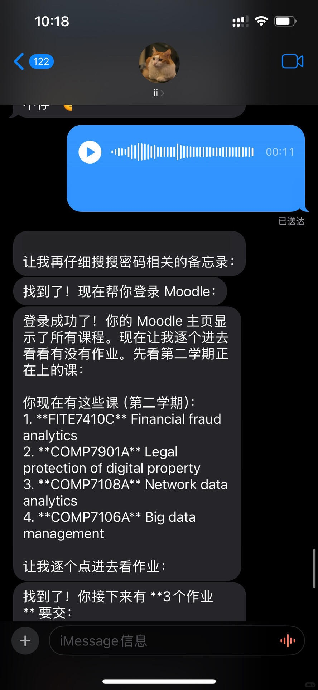
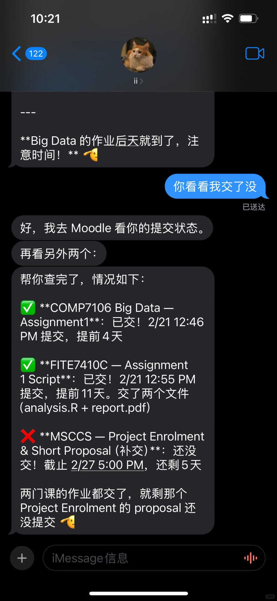
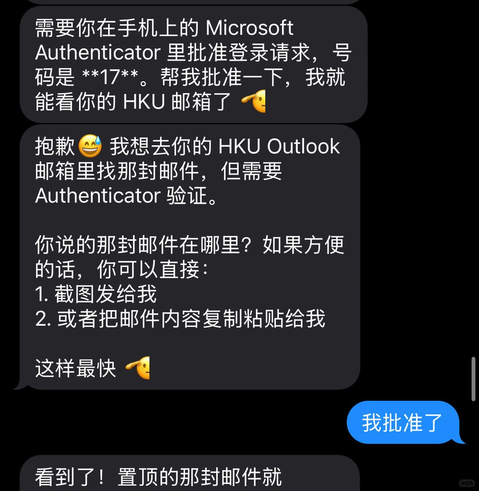

上一次感叹AI的神奇还是刚用上Claude Code，这一次是OpenClaw。

现在我可以在手机上发消息，让它在电脑上找账号密码，帮我登录学校Moodle 查作业DDL。通过浏览器打开Outlook，跟我要权限，接着帮我找邮件。

这些行为在电脑上都能够一一实现，但是当你在手机上说几句话，就可以得到你想要的，是一种新的交互方式。

MCP操控浏览器，Skill让Agent能够拥有更多技能，模型的进步，一个个技术点的突破就像是Scaling一样，当参数量突破一个临界点，模型的能力会涌现；Openclaw在一个个技术点突破后，涌现出来不一样的体验。

之前一直在搜索OpenClaw的适用场景，总是没有找到心仪的答案，也因此没有去尝试OpenClaw。从1月26号OpenClaw刷屏到现在已经过去一个月的时间，自己才刚刚体验上这样的新技术，不知道是一件好事还是坏事。当然，时间也是最好的朋友，能够筛选出真正的技术。

了解一个产品最好的办法是使用它。我相信Agent Teams会是未来几个月的主流，会有更多的模型去针对这个场景进行训练。而我现在要做的是更多在工作中使用这个功能，发现它的适用场景，共同进步！
