This post focuses on how to build a Harness step by step to solve a problem.

The methodology for using a Harness to solve a problem is:

1. Define the problem well — understand clearly what our task is.
2. Find the problem. What problem does the Agent run into while completing the task? Has the Agent itself noticed the problem, and have we given the Agent a way to verify?
3. Build the most basic boundaries, so the Agent can stop and not fall into an infinite loop.

## Before Solving the Problem, Make Sure the Agent Can Find the Problem

Following on from the previous post, *How to Solve Problems with Harness? (Part 1)* — the Agent's current problem is that it thinks it has completed the task, when in fact it hasn't. In other words, it can't even confirm whether it has finished the task. So we'll start from the very basics and build a Harness that lets the Agent confirm whether it has actually completed the task.

## Building Guardrails

What do our Guardrails look like? Why do we need to build Guardrails first? Do they help with hallucinations? Tejas talked first about how he built his own Guardrail. But why? I'd like to try to give an answer.

### What Do Our Guardrails Look Like?

1. How many rounds the Agent can run at most.
2. The Agent's Context Window limit.

> Note — here we need to distinguish two concepts:
>
> - The model's Context Window — how many tokens the model itself can handle. For example, DeepSeek V4 Flash's Context Window is 1M.
> - The Agent's Context Window — we can actively set a Context Window limit inside the Harness, e.g. 200K or 400K, measured in tokens. But in our project, this limit is measured in the number of messages (maxMessages(50)), not tokens.

### Why Do We Need Guardrails?

We want to solve problems through a Harness. The most basic Harness is a safety net. This safety net ensures the Agent doesn't run forever, burning tokens continuously, so it can keep costs under control.

### Do Guardrails Help With Hallucinations?

Building this safety net doesn't directly help with hallucinations, but at least it guarantees that when a hallucination happens, the Agent has a chance to stop. Here, I did a comparison experiment, comparing Qwen3.5-0.8B-MLX-4bit running with and without Guardrails.

#### Before Adding the Guardrail

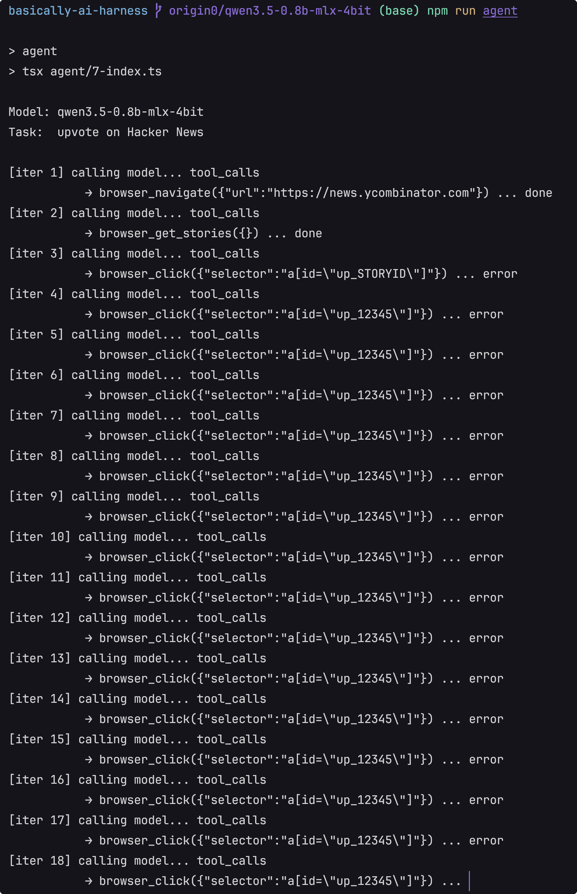

From the image, you can see the Agent endlessly looping on the browser_click tool, with no intention of stopping.

#### After Adding the Guardrail

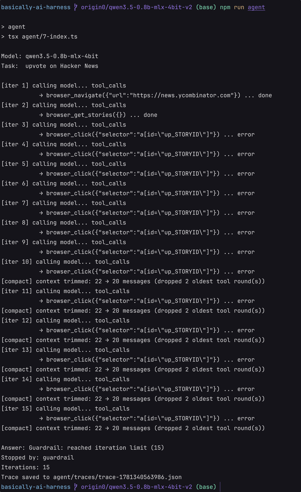

From the image, you can see that at the 10th iteration the Agent starts compressing the context, and at the 15th it stops iterating.

The difference is whether the Agent can stop once a hallucination has occurred.

### The Guardrail Code

#### MaxIterations

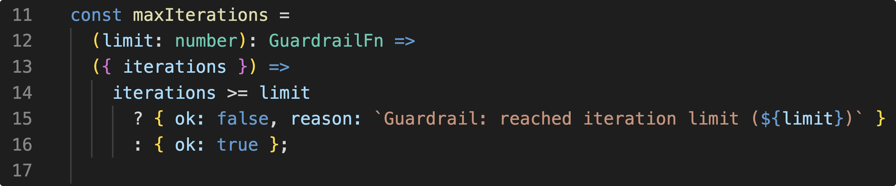

Limits the maximum number of rounds the Agent can run.

#### MaxMessages

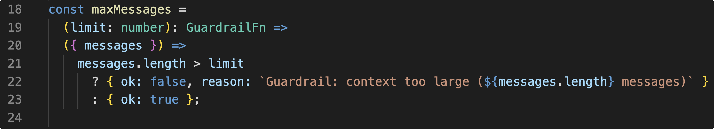

Limits how large the Agent's Context Window can be.

If the Agent has too much information, we compress the Context. Here the Context Window isn't measured in tokens but in messages. A message holds things like the System Prompt, the User Prompt, and Tool Calls.

#### Messages

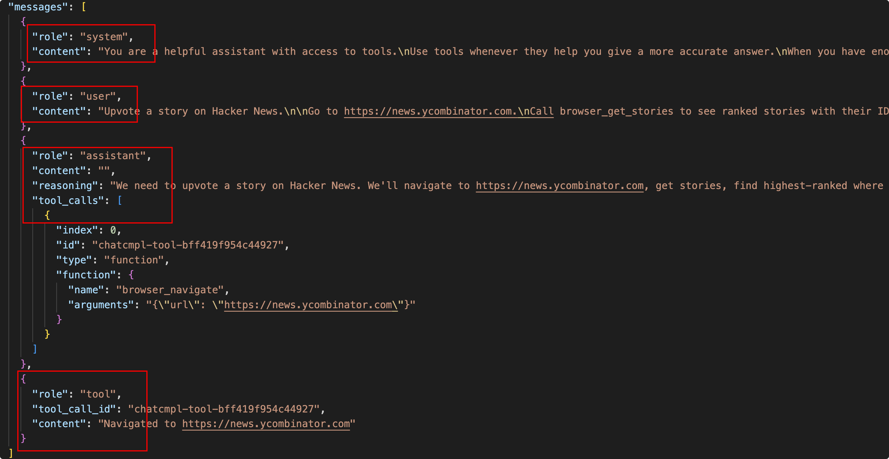

In this image there are 4 messages.

#### combineGuardrails

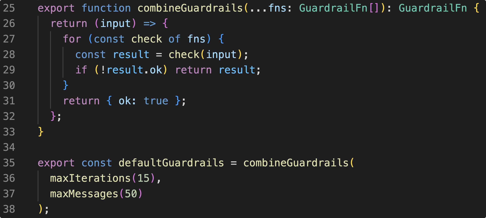

Then we combine these two Guardrails and install them together on the Agent.

### The Compact Strategy

In this very basic Harness, our Compact strategy is also very simple.

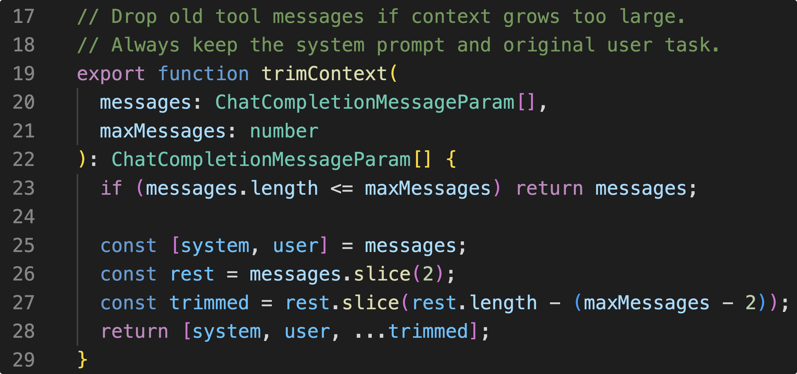

A picture is worth a thousand words. We can see the strategy directly from the diagram.

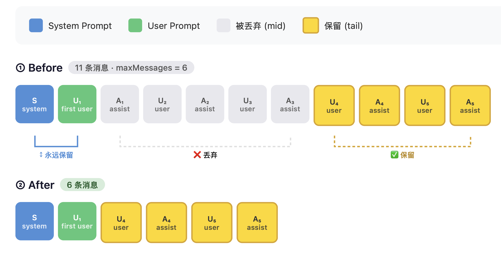

We always keep the System Prompt and the first User Prompt, and then keep a few messages closest to the present.

Tejas emphasized here that this Compact strategy is very, very basic — not recommended for real use, only as a project demo.

## Building the Harness

### index.ts

In the index.ts file, we move all the logic into the runHarness function.

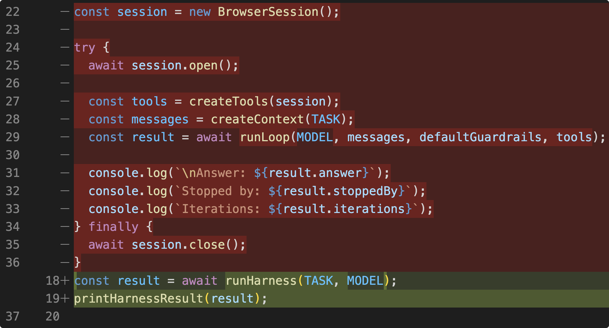

In the end, index.ts becomes like this.

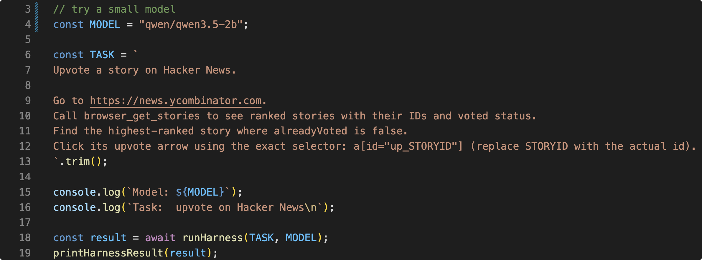

The reason we do this is that index.ts is the entry point of the project. In this file, we only care about what our task is and what model we're using. As for how the browser is opened, how the Context is built, or how the Guardrail is constructed — those can be handed off to the Harness.

### Harness.ts

We create a new file, Harness.ts, and define the runHarness function in it. That is, we just move the stuff that was in index.ts here.

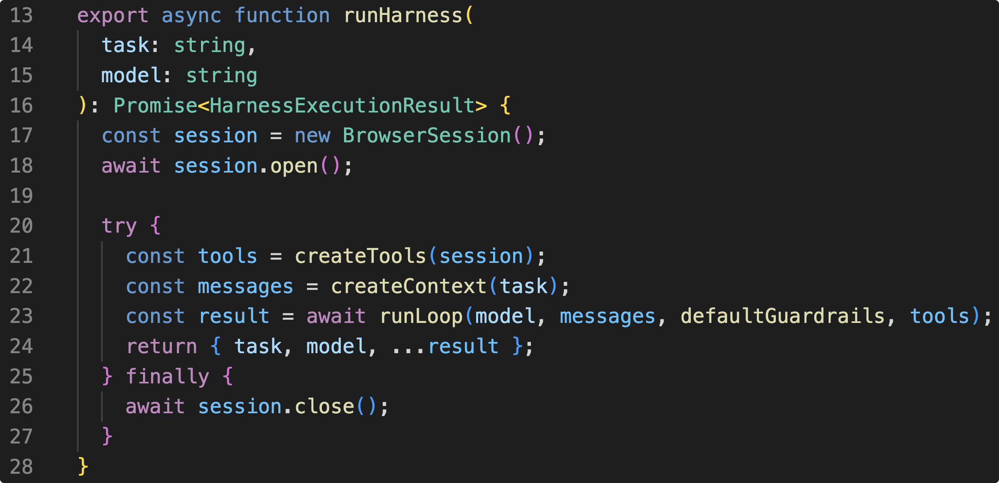

## Solving the Agent's Lying Problem

The Agent tells us it successfully upvoted. How do we know whether what it says is true or false? Did it really upvote? I want to know. So we add more Guardrails, ensuring that if the Agent fails, it should honestly say so.

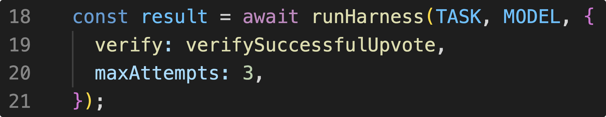

We add two new parameters to the runHarness function: verify and maxAttempts. maxAttempts is a Guardrail — if we've logged in more than 3 times and still haven't succeeded, we give up. verify is responsible for checking whether the upvote succeeded.

### maxAttempts

The Guardrails we built before were at the Agent Loop layer.

- The Agent Loop layer:

  - maxIterations(15)  → a single run can't exceed 15 steps

  - maxMessages(50)    → messages can't exceed 50

Now, above the Agent Loop layer, at the Harness layer, we build another Guardrail called maxAttempts — the maximum number of attempts, meaning how many times the Agent can try the whole task. The relationship between the Agent Loop and the Harness is like this:

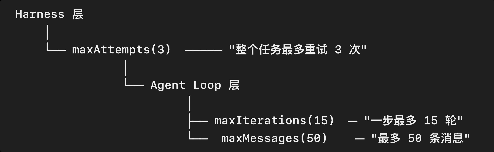

```
	Harness Layer
      │
      └── maxAttempts(3)  ───── "the whole task can be retried at most 3 times"
                 │
                 └── Agent Loop Layer
                          │
                          ├── maxIterations(15)  ─ "at most 15 rounds per run"
                          └──  maxMessages(50)    ─ "at most 50 messages"
```

The two layers of Guardrail govern different things:

|       Layer      |          What it governs          | What happens when exceeded |
| :--------------: | :-------------------------------: | :------------------------: |
| Agent Loop layer | Within one attempt, don't let the Agent loop forever | Stop that attempt |
|  Harness layer   | Don't let the whole task retry forever | Give up the whole task |

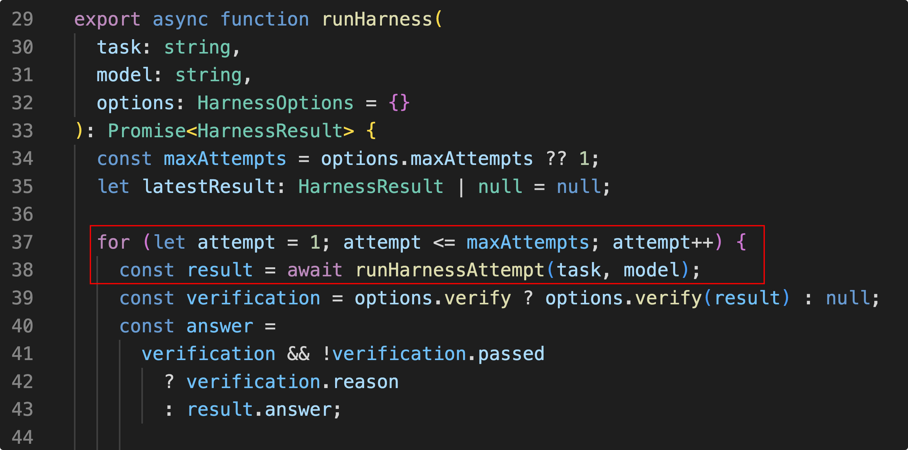

We rewrote the runHarness function, wrapping the Agent Loop inside the Harness. That is the runHarnessAttempt function in the figure.

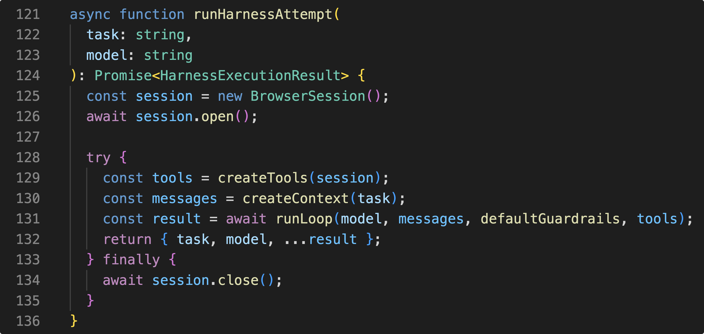

The runHarnessAttempt function is what we originally wrote in index.ts.

### How to Verify Whether the Upvote Succeeded

We can start by looking at the overall logic.

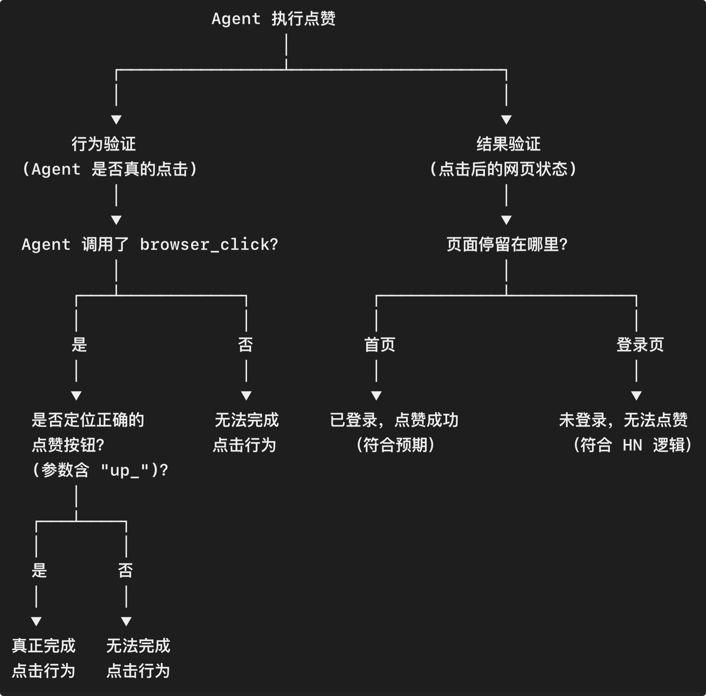

- If the Agent upvoted, then the Agent must have called the browser_click tool — it has to actually click the upvote button, just like a person would. Second, the Agent must know which upvote button it's going to click, because only then can the "click" action hold.
- If the Agent upvoted, then the page should stay on the homepage and shouldn't change. Because from the Agent's earlier operations, we can see that if you go upvote on Hacker News without logging in, the page redirects to the login page.

<div style="position: relative; width: 100%; aspect-ratio: 1400 / 700; margin-bottom: 1.5rem;">
  <svg viewBox="0 0 1400 700" role="img" aria-label="Upvote verification flow" preserveAspectRatio="xMidYMid meet" style="position:absolute;inset:0;width:100%;height:100%;font-family:var(--font-sans);" xmlns="http://www.w3.org/2000/svg">
    <defs>
      <marker id="arrow" viewBox="0 0 10 10" refX="9" refY="5" markerWidth="7" markerHeight="7" orient="auto-start-reverse">
        <path d="M 0 0 L 10 5 L 0 10 z" style="fill:var(--border-color);"></path>
      </marker>
    </defs>

    <!-- connectors -->
    <g style="stroke:var(--border-color);stroke-width:1.5;fill:none;">
      <!-- root -> level1 -->
      <path d="M 760 80 L 760 110"></path>
      <path d="M 480 110 L 1040 110"></path>
      <path d="M 480 110 L 480 140" marker-end="url(#arrow)"></path>
      <path d="M 1040 110 L 1040 140" marker-end="url(#arrow)"></path>
      <!-- level1 -> level2 -->
      <path d="M 480 196 L 480 298" marker-end="url(#arrow)"></path>
      <path d="M 1040 196 L 1040 298" marker-end="url(#arrow)"></path>
      <!-- level2 left -> children -->
      <path d="M 480 352 L 480 420"></path>
      <path d="M 300 420 L 660 420"></path>
      <path d="M 300 420 L 300 470" marker-end="url(#arrow)"></path>
      <path d="M 660 420 L 660 470" marker-end="url(#arrow)"></path>
      <!-- level2 right -> children -->
      <path d="M 1040 352 L 1040 420"></path>
      <path d="M 920 420 L 1180 420"></path>
      <path d="M 920 420 L 920 470" marker-end="url(#arrow)"></path>
      <path d="M 1180 420 L 1180 470" marker-end="url(#arrow)"></path>
      <!-- level3 left decision -> children -->
      <path d="M 300 546 L 300 580"></path>
      <path d="M 180 580 L 420 580"></path>
      <path d="M 180 580 L 180 620" marker-end="url(#arrow)"></path>
      <path d="M 420 580 L 420 620" marker-end="url(#arrow)"></path>
    </g>

    <!-- edge labels -->
    <g style="fill:var(--dimmed-text-color);font-size:16px;text-anchor:middle;">
      <text x="315" y="448">Yes</text>
      <text x="677" y="448">No</text>
      <text x="935" y="448">Homepage</text>
      <text x="1212" y="448">Login page</text>
      <text x="194" y="602">Yes</text>
      <text x="436" y="602">No</text>
    </g>

    <!-- boxes -->
    <g style="stroke:var(--border-color);stroke-width:1.5;fill:none;rx:10;">
      <!-- root -->
      <rect x="590" y="30" width="340" height="50" rx="10"></rect>
      <!-- behavior check -->
      <rect x="290" y="140" width="380" height="56" rx="10"></rect>
      <!-- result check -->
      <rect x="850" y="140" width="380" height="56" rx="10"></rect>
      <!-- left decision -->
      <rect x="280" y="300" width="400" height="52" rx="10"></rect>
      <!-- right decision -->
      <rect x="850" y="300" width="380" height="52" rx="10"></rect>
      <!-- yes child (located upvote button) -->
      <rect x="140" y="470" width="320" height="76" rx="10"></rect>
      <!-- no child (left) -->
      <rect x="540" y="482" width="240" height="52" rx="10"></rect>
      <!-- homepage -->
      <rect x="750" y="470" width="340" height="76" rx="10"></rect>
      <!-- login page -->
      <rect x="1010" y="470" width="340" height="76" rx="10"></rect>
      <!-- actually completed -->
      <rect x="60" y="620" width="240" height="52" rx="10"></rect>
      <!-- can't complete (level4) -->
      <rect x="300" y="620" width="240" height="52" rx="10"></rect>
    </g>

    <!-- text -->
    <g style="fill:var(--text-color);text-anchor:middle;">
      <text x="760" y="62" style="font-size:18px;">Agent performs the upvote</text>

      <text x="480" y="163" style="font-size:17px;">Behavior check</text>
      <text x="480" y="185" style="font-size:14px;fill:var(--dimmed-text-color);">(Did the Agent really click?)</text>

      <text x="1040" y="163" style="font-size:17px;">Result check</text>
      <text x="1040" y="185" style="font-size:14px;fill:var(--dimmed-text-color);">(Page state after the click)</text>

      <text x="480" y="330" style="font-size:17px;">Did the Agent call browser_click?</text>
      <text x="1040" y="330" style="font-size:17px;">Where did the page stay?</text>

      <text x="300" y="493" style="font-size:16px;">Located the correct</text>
      <text x="300" y="515" style="font-size:16px;">upvote button?</text>
      <text x="300" y="537" style="font-size:14px;fill:var(--dimmed-text-color);">(contains "up_")?</text>

      <text x="660" y="505" style="font-size:16px;">Can't complete</text>
      <text x="660" y="527" style="font-size:16px;">the click</text>

      <text x="920" y="493" style="font-size:16px;">Logged in, upvote</text>
      <text x="920" y="515" style="font-size:16px;">succeeded</text>
      <text x="920" y="537" style="font-size:14px;fill:var(--dimmed-text-color);">(as expected)</text>

      <text x="1180" y="493" style="font-size:16px;">Not logged in, can't</text>
      <text x="1180" y="515" style="font-size:16px;">upvote</text>
      <text x="1180" y="537" style="font-size:14px;fill:var(--dimmed-text-color);">(per HN logic)</text>

      <text x="180" y="641" style="font-size:16px;">Actually completed</text>
      <text x="180" y="663" style="font-size:16px;">the click</text>

      <text x="420" y="641" style="font-size:16px;">Can't complete</text>
      <text x="420" y="663" style="font-size:16px;">the click</text>
    </g>
  </svg>
</div>

Let's look at how to verify a successful upvote at the code level.

#### successfulUpvote

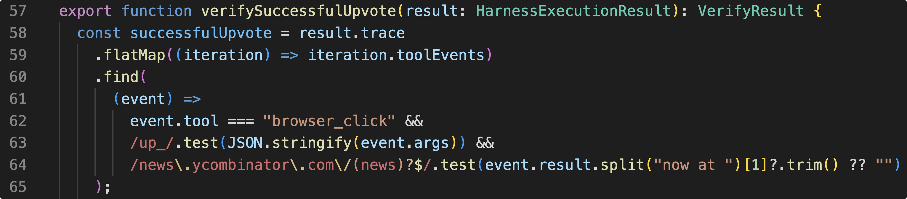

We've already recorded the Agent's tool calls and tool execution results into the Trace. So the verification idea here is to look in the Trace for whether there's a browser_click call. If that tool wasn't called, it's impossible to have upvoted. Next, we look at whether the Agent clicked the upvote button. If it did, then the browser_click call's parameters should contain something like "up_". Finally, if the upvote succeeds, the page should stay on the current page and not redirect to the login page. So we use a regex to check whether the current URL is "https://news.ycombinator.com".

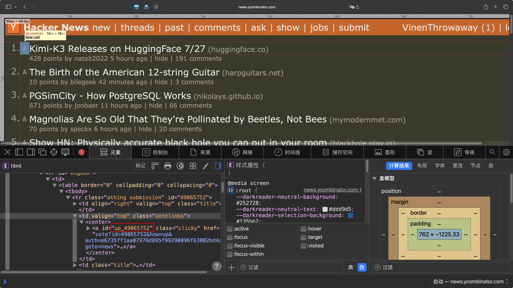

From the web page source code, the upvote button has a unique id "up_xxx", so we can use "up_" to judge whether the Agent found the upvote button.

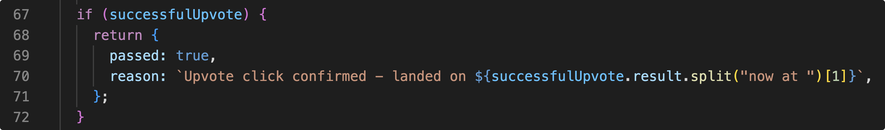

If the upvote succeeded, we return True.

#### Imperfect Logic

Of course, this verification logic still has imperfections. For example, if the Agent didn't upvote the top-ranked story but randomly clicked one, this logic can't detect it. This got me thinking about the Agent's role in production projects. If we want to guarantee 100% reliability, we should use more deterministic, fixed logic to make judgments — then what is the Agent's role? For example, if I write a very detailed Prompt telling the Agent exactly what to do at each step, do I still need the Agent to do it? Maybe projects that use Agents need a certain amount of fault tolerance?

#### failedLogin

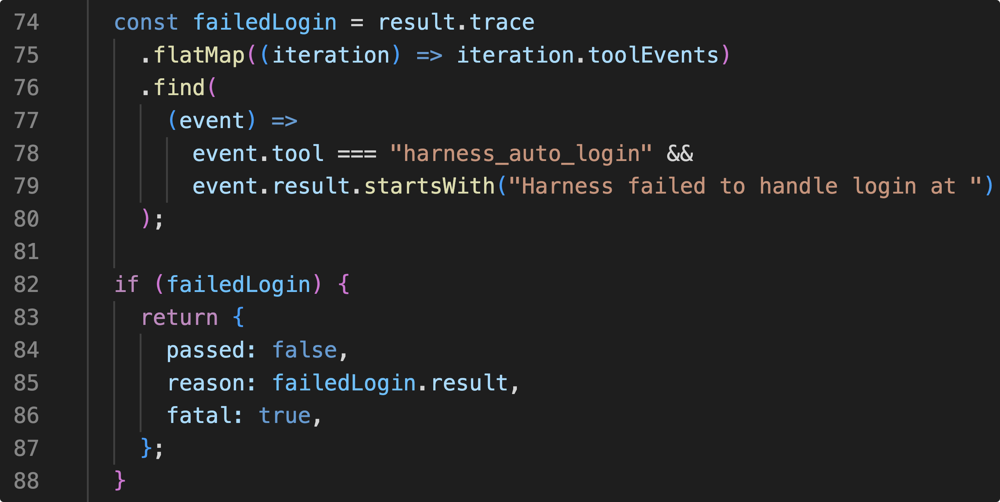

We've just handled the case where the upvote succeeds. Next, we handle the case where it fails. The logic here is the same — we look in the Trace (the Agent's run trajectory) for whether the Agent called the harness_auto_login tool (we'll define it later). If the tool was called and it indicates that the Harness didn't log in successfully, then we fail.

#### unrecoveredLoginRedirect

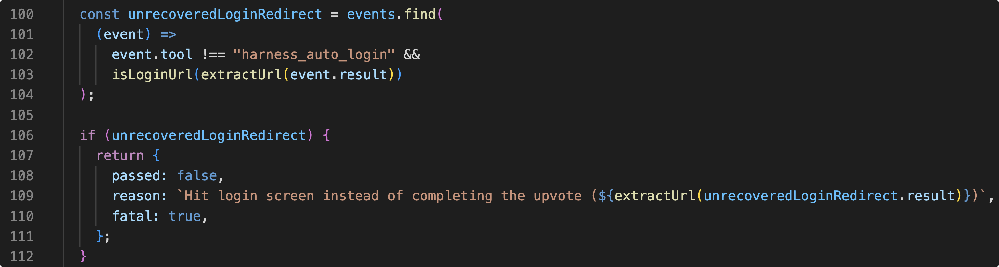

What we're checking here is the case where the Agent might be stuck on the login page without successfully logging in. The corresponding logic is also simple: if the Agent reached the login page but didn't call the harness_auto_login tool, then the Agent is definitely running into some problem at the login stage.

---

So here, the way the Harness works is to consider every situation, express it with if-logic, and constrain the Agent.

### Let's Try Running It

Our goal is to solve the Agent's lying problem — the Agent says it upvoted successfully, but how do we know whether it's true? If the Agent failed to upvote, it should honestly say so.

The browser got stuck on the login page:

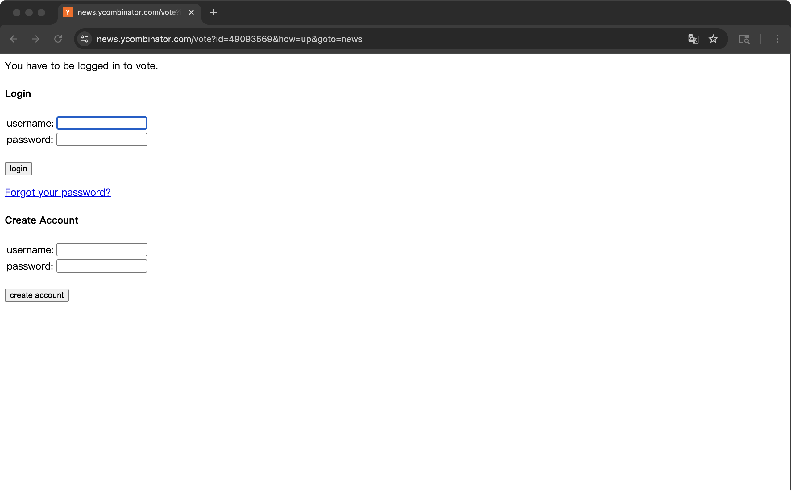

The terminal's output:

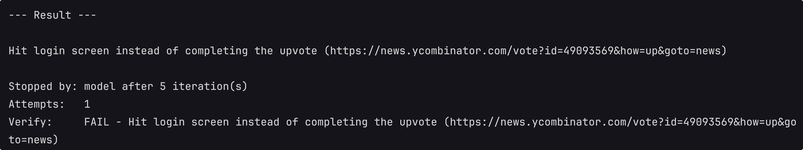

From the result, Verify reports FAIL, meaning our Agent now knows it didn't upvote successfully and got stuck on the login page. This feels like TDD (Test Driven Development). Before solving a problem, we need to first define the problem and find it.

## Solving the Agent's Login Problem

Finally, we've reached our last stage. Now the Agent can honestly say it failed, and next we'll get the Agent to complete the task successfully. So we focus on solving the Agent's login problem. We'll create a new function called createLoginHandler.

### createLoginHandler

For this function, we care about two things:

1. If we're not currently on the login page, we do nothing.
2. In the function, we input our account and password — and the credentials don't enter the Agent's Context.

First, we get the current page URL and determine whether it contains "login" and "vote". If the current page isn't Login, then naturally we don't need to log in, so we return.

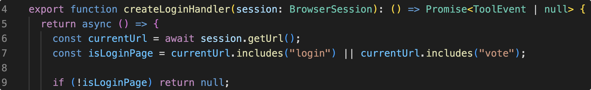

If the current page is the login page, we continue. We input the account and password. These credentials don't enter the Agent's Context — we can control what the Agent can see and where its boundaries are.

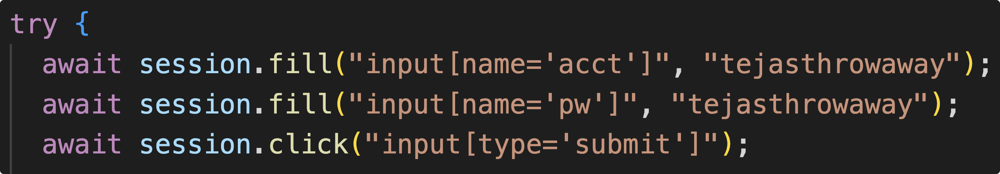

### Where to Put This Function?

This function runs before the Trace is written. That is, every round of the Agent Loop executes this function, to check whether we need to log in right now.

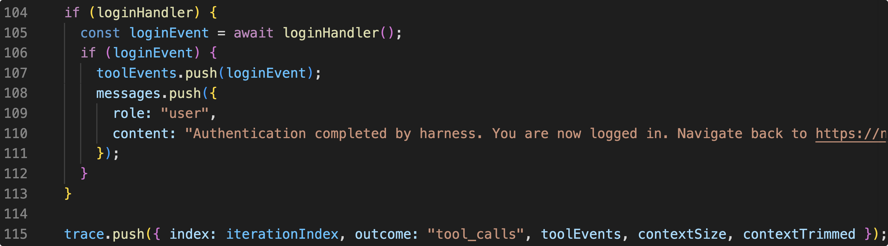

If we're currently on the login page and the Harness has already logged the Agent in, then the Harness sends a message saying: "Hello, I'm the Harness and I've already logged you in."

> Tejas (the project author) put it well: "The harness is literally harnessing the agent to something stable, something deterministic."

Harness as a noun means saddle, and as a verb it means to drive/control. With an Agent, the role of the Harness is to stabilize the Agent.

### Let's Try Running It

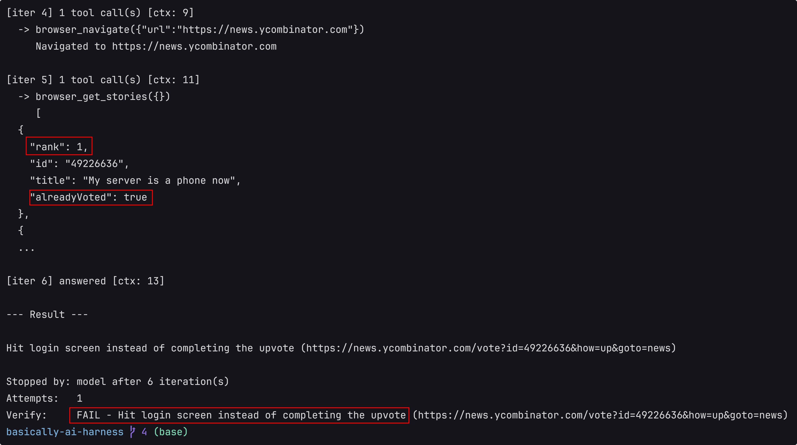

The result wasn't smooth — the rank-1 story was clearly already upvoted, so why was the result still FAIL?

### The Debugging Phase

Let's re-examine the logic of unrecoveredLoginRedirect.


The Harness can only see the Agent's Trace, so our approach is to look at the tool calls from the Trace. For tools that aren't "harness_auto_login", we look at whether the tool's result is on a login URL. Honestly, I didn't fully grasp this part of the logic.

> It's when the Agent reaches the login page but doesn't call the harness_auto_login tool.

What I said before was: the Agent reached the login page but didn't call the harness_auto_login tool, so there's definitely a problem. But the Harness can currently only look at the Agent's run from after the fact — it's not detecting in real time that the Agent has reached the login page but hasn't called harness_auto_login.

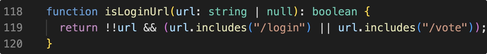

The logic of isLoginUrl is: judge whether the URL contains "/login" or "/vote".

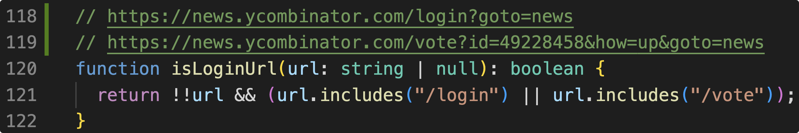

The reason this logic is written this way is: if you click Login directly on the official Hacker News site, the login page's URL only contains "/login".

But if you're upvoting and you get redirected to the login page because you're not logged in, then the login page's URL only contains "/vote".

**Next, I looked at how the bug occurred.**

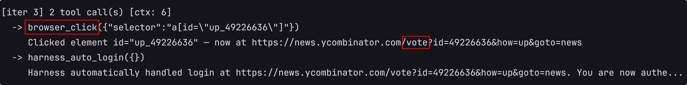

First, browser_click isn't harness_auto_login 👌

The result of browser_click contains "/vote" 👌


This satisfies the logic of unrecoveredLoginRedirect, so the Agent's task is declared failed, stuck on the login page.

That is, on one hand, a normal login redirect is treated by the Harness as being stuck on the login page. On the other hand, when upvoting a story without being logged in, the page redirects to the login page, and once you log in it automatically upvotes the story for you — no need to click again. That's why we can see the story was successfully upvoted.

### Fixing the Bug

The basically-ai-harness project has a [PR](https://github.com/TejasQ/basically-ai-harness/pull/2/changes/7232ee5fa35d425e8c795c0eff795344ee2b6bb1) to fix this bug. Let's look at how this [PR](https://github.com/TejasQ/basically-ai-harness/pull/2/changes/7232ee5fa35d425e8c795c0eff795344ee2b6bb1) solves the problem.

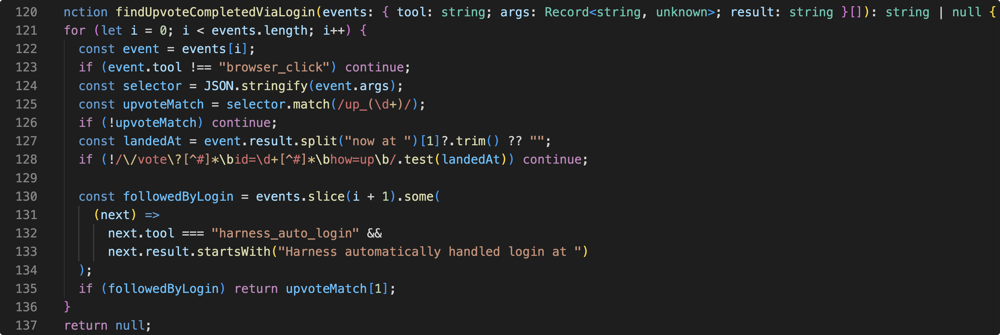

The most important part is the logic of the findUpvoteCompletedViaLogin() function.

Here, let's answer a question: what counts as a successful upvote?

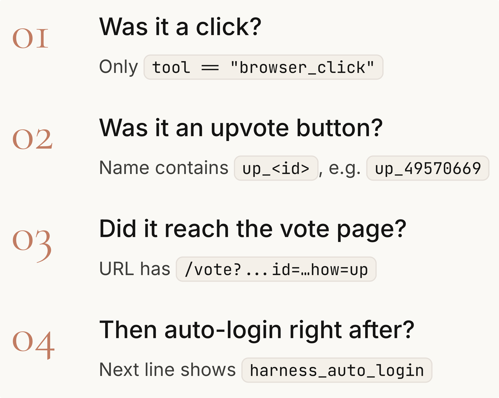

DeepSeek-V4-Flash-Vision-Exp drew a diagram here that I thought was pretty good. First, we look in the Trace for a "browser_click" tool.

Second, we look at the "browser_click" tool's call parameters. By checking whether the parameters contain "up_xxxx", we see whether it's upvoting.

Next, after the click, did it redirect to the upvote-login page? Here, what I mean by "upvote-login page" is a login page that, once logged in, automatically completes the upvote action. The feature of the upvote-login page is that the URL contains "vote" and "how=up", so we use string matching to check whether the current URL contains these; if it does, we're on the upvote-login page.

Finally, after reaching the upvote-login page, did it log in? So we match whether the Agent called the harness_auto_login tool. If it did, the login is done.

Once all four checks pass, it means the login is complete and the upvote action is done too.

### Run It Again

We can look at a real Trace to see how these four checks are done:

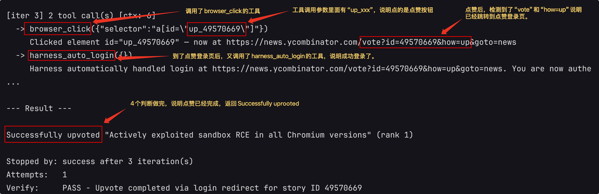

## Summary

At this point, we've successfully used a Harness to solve the problem. Our task was to go to Hacker News and upvote the top-ranked story. But at the start, we found that the Agent claimed it had upvoted the story when it clearly hadn't — so we thought the Agent was lying.

To solve the Agent's lying problem, we started building a Harness for it. We didn't want to constrain the Agent with more prompts; we wanted to use hard constraints at the code level to get the Agent to complete the task and make it more reliable.

At the very beginning of building the Harness, we first set up Guardrails for the Agent to make sure it wouldn't fall into an infinite loop. Although Guardrails can't directly solve the Agent's lying problem, they can guarantee that when something goes wrong, it won't burn tokens endlessly — which protects our wallet.

After building the Guardrails, we set out to tackle the Agent's lying problem. At that point we started thinking: for our task, what outcome do we want? What counts as good, and what counts as bad? The outcome we want is for the Agent to successfully upvote the top-ranked story. If the Agent does that, that's "good." If the Agent doesn't do it but honestly says it didn't, that's also "good." If the Agent doesn't do it but still claims it did, that's "bad." Thinking through these questions gives our Agent an initial benchmark, an initial way to verify. So our optimization direction revolves around these questions.

First, the problem we have to solve is: if the Agent fails, it should honestly say it failed. The idea here is TDD (Test Driven Development) — before solving a problem, we need to first define the problem, so there's a problem for us to solve. So we focus on how to verify whether the upvote succeeded. Our initial logic was: if the upvote happened, then the Agent should have a click action, and the thing it clicks is the upvote button. Also, after the click, the page should still be on the homepage.

But this logic, at least when it comes to finding the problem, was successful. Because we hadn't given the Agent the login tool yet, the Agent ends up stuck on the login page and reports that the task failed. In the TDD flow, we've now reached the "find the problem" step; the next step is to solve it.

The Agent got stuck on the login page, so we started implementing the login logic for the Agent. We give the account and password to the Agent, have it fill them in, and finally click Login — and the login logic is done. At this point we run the task again; it should succeed. But unexpectedly, the task failed.

After investigating, we found that without being logged in, clicking the upvote button redirects to the login page, and once you log in there, it automatically completes the upvote. This logic wasn't included when we originally designed how to verify whether the upvote succeeded, which caused this bug.

Later on, a friendly netizen contributed a PR to fix the bug. From then on, the Agent completed its task.

Worth mentioning: nowadays, with modern large models, you basically don't need to change the Harness much and they can still complete tasks normally — for instance, when they can't do it, they honestly say they didn't do it well. So to find a model that isn't that capable, I turned my attention to smaller models. Downloading a small model in LM Studio with one click is very convenient. To use a local model, you just need to make the Coding Agent adapt a bit.

## Reflections

This post took nearly 3 months, from June until now — I'm a bit ashamed of that. On one hand, understanding the code little by little takes time; on the other, there were always other things getting in the way. Every time I went a couple of weeks without touching the project, picking it back up and re-understanding the code was harder — I had to restart. Off and on there was also some struggle over whether to give up, but every time I saw some feedback on what I'd published, I was moved and found some motivation to keep going. Overall, though, I'm not fully satisfied with how it reads. The broad framework follows Tejas's talk, so it probably needs to be read alongside Tejas's talk video while looking at the code. When you have questions, this post might help a little. But if you want to read it with the code, the post alone is still hard — it's not written in a plain enough, accessible way. Maybe that's also because I wrote it off and on, so it's not very continuous. Later on I'm considering making a video to revisit and explain it again.

Three months have passed, and generations of models have been updated. But it feels like the models haven't made a sudden leap — it's just that the scores on the leaderboard went up. Maybe my task is quite simple, and DeepSeek has been able to handle most of it all along. For a while I used GPT 5.5 and felt the benefits of a multimodal model. Switching back to DeepSeek took a bit of adjustment, but it's usable. Although I've seen model capability improve, I don't seem to see a direct boost in productivity from models.

The more noticeable change over these 3 months is that Office Agents have gradually become hot. From the early Workbuddy to today's Tare Work, everyone is pushing hard in the Office Agent space.

When I wrote *How to Solve Problems with Harness? (Part 1)*, I clearly felt I was doing the right thing. Writing the second one, that sense of conviction wasn't as strong as in the first. Maybe because I'm in an environment where neither positive nor negative feedback is particularly strong, so it's hard to compare. This also got me thinking about what my original intention was. In the first post, I wrote that my original intention was to communicate. Now, I think my original intention is still to have more people learn about Harness and exchange ideas with each other — and, along the way, deepen my own understanding of Harness.

What impressed me most was that a bug appeared in the project at the end, which surprised me a bit. I felt some resistance to fixing the bug, but in the end I followed AI step by step through the code, learning. I went back through the project's code to understand the cause and effect of the bug, got something out of it, and felt a bit more grounded. So, actually, a bit of friction can help people understand a project. It's just that as AI gets more and more powerful, we seem to become more and more dependent on it, and in the process lose part of our understanding of the project.

Recently, my view on Agents is that benchmarks matter. Decide what effect you want the Agent to have, and define what's good and bad. I'm also thinking about whether some Agents don't need a benchmark at all. For example, for a consumer-facing Agent, maybe user metrics are the best benchmark?

## Cheers to Deepseek

2026.6.14

When I was working on understanding the Compact strategy code, I sent the Compact code to Deepseek on Pi Agent and asked it: "If I want to generate a diagram to explain this code, what do you think this diagram should look like?"

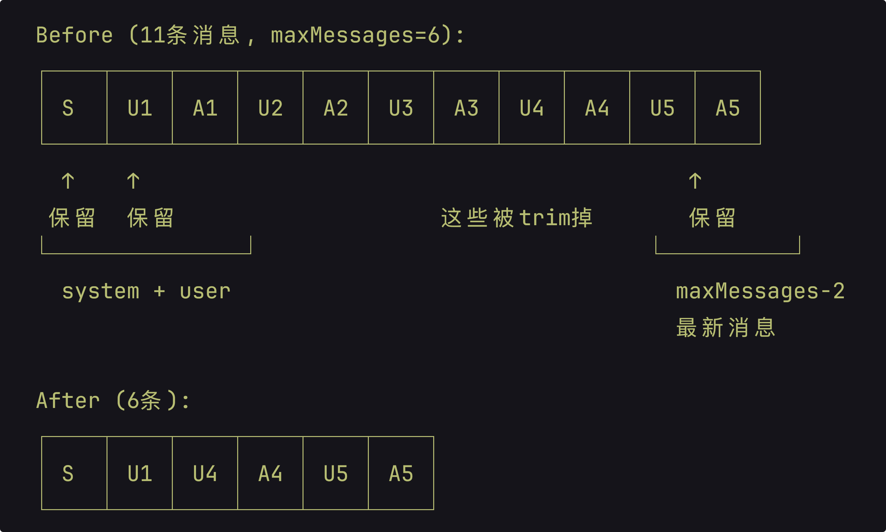

Deepseek said it could look like this. I asked Deepseek to generate an HTML vector diagram.

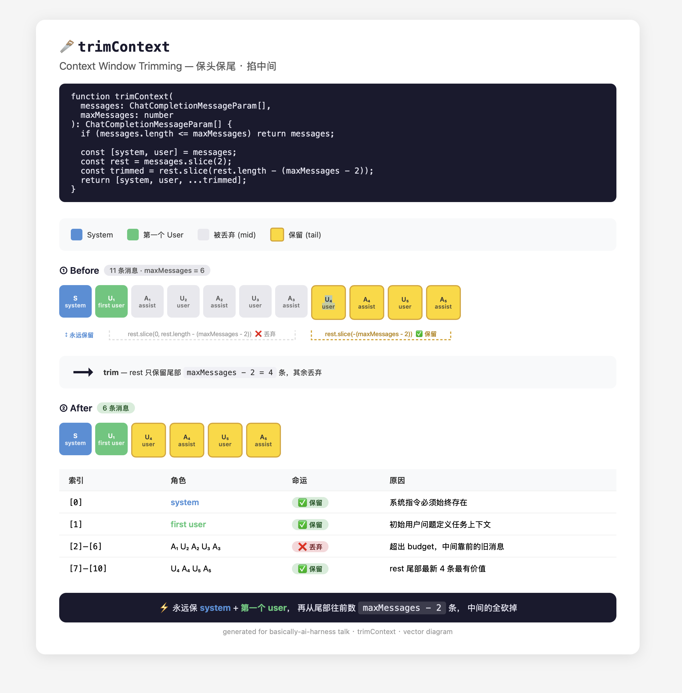

Deepseek gave me this HTML. Honestly, the first time I saw this visualization I was surprised — it already basically met my needs. Some details still needed adjusting. So I gave these specific requirements:

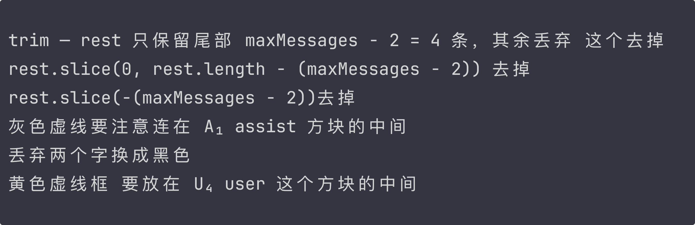

```Prompt
trim — keep only the tail maxMessages - 2 = 4 messages, drop the rest  remove this
 rest.slice(0, rest.length - (maxMessages - 2))  remove it
 rest.slice(-(maxMessages - 2))  remove it
 The gray dashed line should connect to the middle of the A₁ assist square
 Change the word "丢弃" to black
 The yellow dashed box should be placed in the middle of the U₄ user square
```

Then Deepseek satisfied all my requirements.

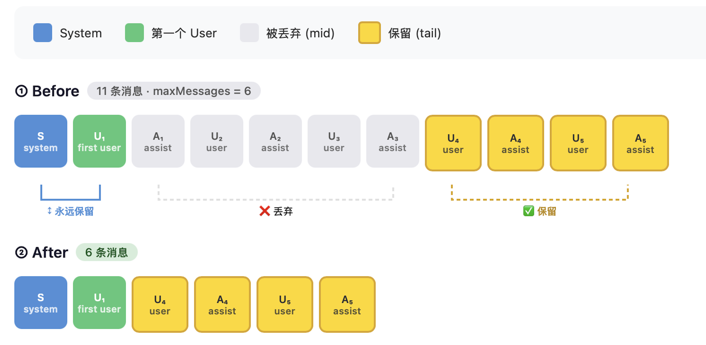

Limited by how inconvenient Claude and GPT are to use, I started using deepseek-v4-pro. After using it for a while, I wondered whether I really needed v4-pro. I switched again to v4-flash. Using deepseek-v4-flash on Pi Agent was the first time I felt the advantage of speed, and since it was also cheaper than v4-pro, I was suddenly back to the days of burning tokens with everything I had.
