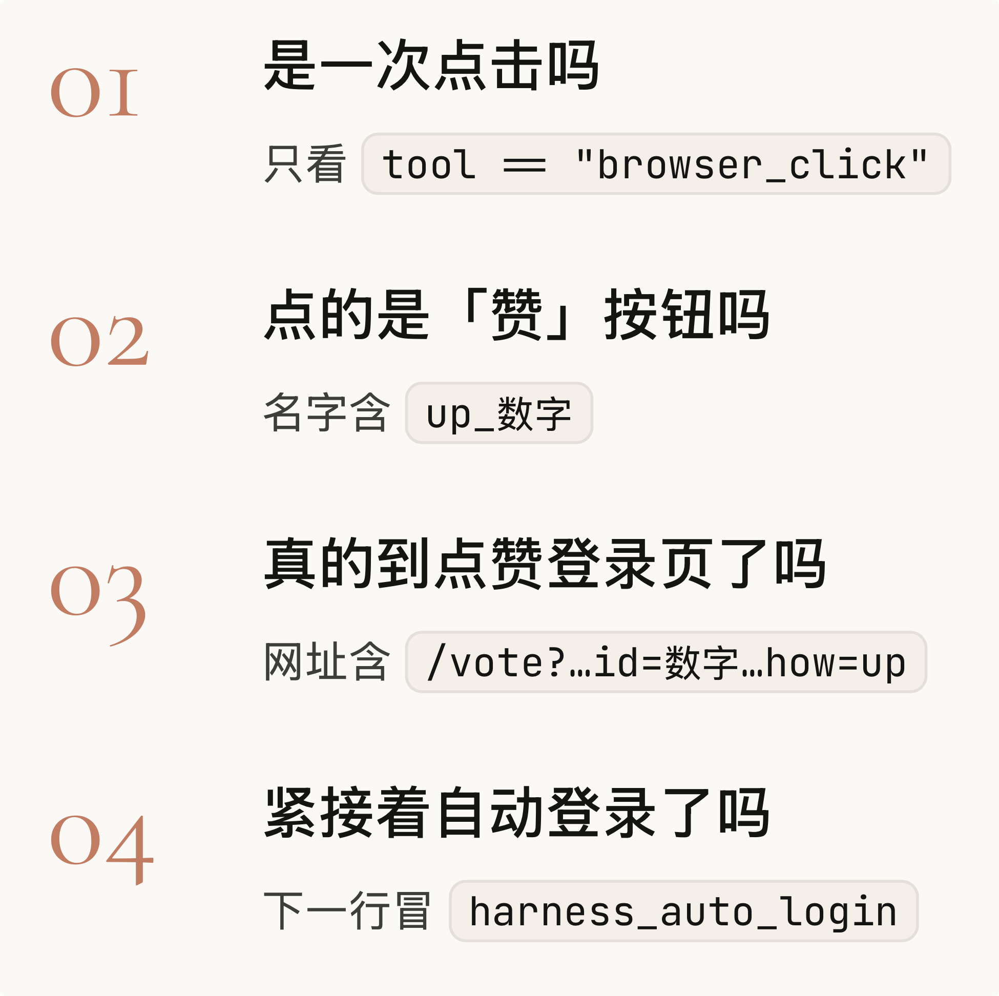

# 如何用Harness解决问题（二）

这篇博客我们会专注于如何一点一点搭建 Harness 解决问题。


用Harness解决问题的方法论是：

1. 定义好问题，了解清楚我们的任务是什么。
2. 发现问题。Agent 在完成任务的过程中遇到了什么问题？Agent 有没有发现自己有问题，我们有没有给 Agent 提供验证的手段。
3. 搭建最基础的边界，让Agent能够停下来，不会陷入死循环。

## 解决问题前需要确保 Agent 发现了问题

接上篇《如何用Harness解决问题（一）》，Agent 当前的问题在于认为自己完成任务了，但事实上并没有。也就是说他连自己有没有完成任务都没办法确定。所以我们会一点一点从最基础的开始去搭建 Harness，让 Agent 能够确认自己有没有完成任务。

## 搭建边界护栏（Guardrail）

我们的 Guardrail 长什么样子？为什么需要先搭建 Guardrail？对解决幻觉有帮助吗？Tejas 在这里是先讲了自己如何搭建 Guardrail. 但为什么呢？我想试着给出回答。

### 我们的 Guardrail 长什么样子

1. Agent 最多可以跑多少轮。
2. Agent 的 Context Window 上限。

> 注意，这里需要区分两个概念：
>
> - 模型的 Context Window —— 模型本身能处理多少 Token。例如 DeepSeek V4 Flash 的 Context Window 是 1M。
> - Agent 的 Context Window —— 我们可以在 Harness 里面主动设置 Context window 的上限，比如 200K, 400K 单位是 Token。但在我们的项目里，这个上限以 Message 数量为单位（maxMessages(50)），而不是 Token。

### 为什么需要搭建 Guardrail？

我们想要通过Harness解决问题，最基础的Harness是一个安全网。这个安全网可以保障 Agent 不会无限的运行下去，一直消耗Token，可以控制一定的成本。

### Guardrail 对解决幻觉有帮助吗？

构建这个安全网，并不会对解决幻觉有直接的帮助，但至少可以保证当幻觉发生了，Agent可以有机会停下来。在这里，我做了一个对比试验。对比 Qwen3.5-0.8B-MLX-4bit 在添加 Guardrail 前后的运行结果。

#### 添加 Guardrail 前


从图中可以看到 Agent 不断地在循环调用 browser_click 的工具，没有停下来的意思。

#### 添加了 Guardrail 后


从图中可以看到，Agent在第10轮迭代的时候，开始进行上下文的压缩。同时在第15轮的时候停止迭代。

区别在于，Agent 在出现幻觉以后是否能够停下来。

### Guardrail 的代码

#### MaxIterations


限制 Agent 最多可以跑多少轮。

#### MaxMessages


限制 Agent 的 Context window 有多大。

如果 Agent 拥有的信息太多，我们就对 Context 进行压缩。这里的 Context Window 没有以 Token 为单位，而是以 Message 为单位。Message 里面装着 System Prompt，User Prompt 和 Tool Call 等等。

#### Messages


像在这张图里就有4个 messages.

#### combineGuardrails


再把这两个 Guardrail 组合起来，一起给 Agent 装上。

### Compact 策略

在这个非常基础的 Harness 中，我们的 Compact 策略也很简单。


一图胜千言。我们直接看示意图就可以明白策略是怎么样的了。


我们总是把 System Prompt 和 第一条 User Prompt 留住，然后再保存离当前最近的几条 message.

Tejas 在这里强调 Compact 的策略非常非常基础，并不推荐在实践中使用，只作为项目演示。

## 搭建 Harness

### index.ts

在 index.ts 这个文件中，我们把所有的逻辑都移动到 runHarness 这个函数中。


最终 Index.ts 变成这样。


我们这样做的原因是 Index.ts 作为项目的入口，其实在这个文件里面我们只关心我们的任务是什么，我们使用的模型是什么。至于浏览器怎么打开，Context 怎么构建，或者 Guardrail（护栏）怎么构建，这些东西可以交给 Harness.

### Harness.ts

我们新创建一个 Harness.ts 的文件，在里面定义好 runHarness 的函数。就是把刚刚写在 Index.ts 的东西放在这里。


## 解决 Agent 说谎的问题

Agent 跟我们说它点赞成功了，我们怎么知道它说的是真的还是假的，它真的点赞了吗？我想知道。所以我们再增加一些 Guardrails（护栏）确保 Agent 如果失败了，应该诚实地说出来。


我们给 runHarness 函数新增 2 个参数。分别是 verify 和 maxAttempts，maxAttempts 是 Guardrail（护栏），如果我们登录超过3次还没有成功，那我们就放弃。verify 负责验证有没有点赞成功。

### maxAttempts

之前我们的搭建的 Guardrails 是 Agent Loop 层。

- Agent Loop 层：

  - maxIterations(15)  → 单次运行不能超过 15 步

  - maxMessages(50)    → 消息不能超过 50 条

现在我们在 Agent Loop 层 之上的 Harness 层再搭建一个 Guardrail 叫 maxAttempts 最大尝试次数，意思是整个任务我们 Agent 能够尝试多少次。Agent Loop 和 Harness 之间的关系就像下面这样


```
	Harness 层
      │
      └── maxAttempts(3)  ───── "整个任务最多重试 3 次"
                 │
                 └── Agent Loop 层 
                          │
                          ├── maxIterations(15)  ─ "一步最多 15 轮"
                          └──  maxMessages(50)    ─ "最多 50 条消息"
```

两层 Guardrail 管的不同的事：


|     层级      |             管什么             |  超了怎么办  |
| :-----------: | :----------------------------: | :----------: |
| Agent Loop 层 | 一次尝试里面，Agent 别无限循环 | 停止这次尝试 |
|  Harness 层   |       整个任务别无限重试       | 放弃整个任务 |


我们把 runHarness 函数重新写了一遍，将 Agent Loop 包含在 Harness 里面。也就是图中的 runHarnessAttempt 的函数。


runHarnessAttempt 函数就是我们最开始写在 Index.ts 里面的东西。

### 如何验证有没有点赞成功

我们可以先从看看整体的逻辑。


- 如果 Agent 点赞了，那么 Agent 肯定有调用 browser_click 的工具，它必须要跟人一样去真的去点击点赞按钮。其次 Agent 一定会知道它要去点击哪个点赞按钮，因为只有这样“点击”这个行为才能够成立。
- 如果 Agent 点赞了，那么网页会停留在首页，不应该发生变化。因为从之前 Agent 的操作中，我们可以看到如果没有登录 Hacker News 直接去点赞，网页会跳转到登录页面。

```
                    Agent 执行点赞
                           │
          ┌────────────────┴─────────────────────┐
          │                                      │
          ▼                                      ▼
      行为验证                                  结果验证
 (Agent 是否真的点击)                       (点击后的网页状态)
          │                                      │
          ▼                                      ▼
 Agent 调用了 browser_click？                页面停留在哪里？
          │                                      │
      ┌───┴────────────┐            ┌────────────┴────────────┐
      │                │            │                         │
      是               否           首页                      登录页
      │                │            │                         │
      ▼                ▼            ▼                         ▼
  是否定位正确的       无法完成     已登录，点赞成功          未登录，无法点赞
  点赞按钮？          点击行为       （符合预期）            （符合 HN 逻辑）
  (参数含 "up_")？
      │
  ┌───┴────┐
  │        │
  是       否
  │        │
  ▼        ▼
真正完成   无法完成
点击行为   点击行为
```

我们从代码层面看看，验证点赞成功如何实现。

#### successfulUpvote


我们已经把 Agent 的工具调用，工具执行结果都记录到了 Trace 里面。所以这里的验证思路是我们从 Trace 里面去找到有没有 browser_click 的调用。如果没调用这个工具，是不可能点赞的。接着我们去看看 Agent 有没有点击点赞按钮。如果有的话，browser_click 的调用参数应该包含了 "up_" 这样的字眼。最后，如果能够成功点赞，网页应该是保持在当前页面的，不会跳转到登录界面去。所以用正则去检测当前的网址是不是 "https://news.ycombinator.com".


从网页的源代码来看，点赞按钮有一个唯一的 id 是 "up_xxx"，因此可以用 "up_" 去判断 Agent 有没有找到点赞按钮。


如果点赞成功了，那我们就返回True.

#### 不完美的逻辑

当然，这个验证的逻辑还有不完美的地方，比如要是 Agent 没有点赞排名第一的文章，而是随便点了一个，这个逻辑没办法检测出来。这让我开始思考 Agent 在生产项目中的作用。如果要保证 100%的可靠性，我们应该用更多确定性的逻辑，固定的逻辑去判断，那么 Agent 的作用是什么？比如我写了一个非常详细的 Prompt 告诉 Agent 每一步该做什么，那我还需要 Agent 去做吗？可能用于 Agent 的项目需要有一定的容错性？

#### failedLogin


刚刚我们处理好了点赞成功的情况，接下来我们处理点赞失败的情况。这里的逻辑还是一样的，我们去 Trace（Agent 运行轨迹）里面找 Agent 有没有调用 harness_auto_login 工具（这个工具的定义我们会在后面给出）。如果调用了工具，并且说明了 Harness 没有成功登录，那么我们就失败。

#### unrecoveredLoginRedirect


这里检测的是 Agent 可能会卡在登录界面，没有成功登录。相应的逻辑也很简单，就是 Agent 到了登录界面，但是却没有调用 harness_auto_login 的工具，那么 Agent 肯定在登录这里，遇到了一些问题。

---

所以，我们这里 Harness 的工作就是把每一种情况都考虑到，并且用 if 的逻辑去表达出来，对 Agent 做限制。

### 跑一次试试看

我们的目标是解决 Agent 说谎的问题，也就是说 Agent 说它点赞成功了，我们怎么知道它说的是不是真的？如果 Agent 点赞失败了，那它应该如实道来。

浏览器卡在了登录界面：


终端的运行结果：


从运行的结果来看，Verify 提示 FAIL，也就是说我们的 Agent 现在能够知道自己没有点赞成功，并且卡在了登录界面。这种感觉就像是 TDD（Test Driven Development） 一样。解决问题前，我们需要先定义问题，发现问题。

## 解决 Agent 登录问题

终于到了我们最后的阶段。现在 Agent 已经能够诚实地说自己失败了，接下来我们会让 Agent 成功完成任务。因此，我们专注于解决 Agent 的登录问题。我们将创建一个新的函数叫 createLoginHandler.

### createLoginHandler

对于这个函数我们关注两点：

1. 如果当前不在登录页面，那我们什么都不做。
2. 我们在函数里面输入我们的账号密码，账号密码不会进入 Agent 的 Context.

我们先获取当前页面的链接，同时确定当前的链接有没有包含 "login" 和 "vote" 的字符。如果当前页面不是 Login 那么也很自然，我们肯定就不用登录了，因此 return.


如果当前页面是登录界面的话，我们就继续往下做。我们输入账号和密码，这里的账号密码是不会进入 Agnt 的 Context 的，我们可以控制 Agent 能够看到什么，它的边界在哪里。


### 把这个函数放在哪里？

这个函数会在 Trace 写入前运行。也就是说，每一轮的 Agent Loop 都会执行这个函数，去检查当前需不需要进行登录。


如果当前是在登录界面，并且 Harness 已经帮 Agent 登录好了。那么 Harness 会发一条 message 说：“Hello 我是 Harness 我已经帮你登录好了。”

> Tejas（项目作者）说的很好：“The harness is literally harnessing the agent to something stable, something deterministic.”

Harness 作为名词是马鞍的意思，作为动词是驾驶的意思。在 Agent 这，Harness 的作用就是 让 Agent 稳定下来。

### 跑一次试试看


结果并不顺利，明明 rank 1 的文章已经点赞了，但为什么结果还是 FAIL？

### Debug 阶段

我们重新再审视一下 unrevoveredLoginRedirect 的逻辑


Harness 能够检测的只有 Agent 的 Trace，所以我们的思路是从 Trace 里面去看看工具调用。对于不是 "harness_auto_login" 的工具，我们去看工具调用的结果是不是在登录的URL。其实这一段的逻辑，我没有想的特别明白。

> 就是 Agent 到了登录界面，但是却没有调用 harness_auto_login 的工具。

我之前说的是 Agent 到了登录界面，但是却没有调用 harness_auto_login 的工具，肯定有问题。但是 Harness 当前只能从事后的角度去看 Agent 有没有出问题，并不是实时地检测 Agent 现在到了登录界面，却没有调用 harness_auto_login 的工具。


isLoginUrl 的逻辑是这样的，判断URL 里面是否有 "/login" 或者 "/vote" 的字符。


这段逻辑这样写的原因是，如果在 Hacker News 的官网直接点击Login，那么登录界面的URL只会包含 "/login".

但是如果是点赞，但是因为没有登录而跳转到登录界面，那么此时登录界面的 URL 只包含了 "/vote".

**接着我去看Bug是怎么产生的。**


首先 browser_click 不是 harness_auto_login 👌

browser_click 的结果里面包含了 "/vote" 👌


满足了 unrevoveredLoginRedirect 的逻辑，因此宣告 Agent 的任务失败，卡在了登录界面。

也就是说一方面，正常的登录跳转被Harness当做卡在了登录界面。另一方面，在没有登录的时候给文章点赞会跳转到登录界面，登录完了以后就自动给文章点赞了，不需要再点一次。这是为什么我们能够看到文章已经点赞成功了。

### 修 Bug

basically-ai-harness 的项目有一个 [PR](https://github.com/TejasQ/basically-ai-harness/pull/2/changes/7232ee5fa35d425e8c795c0eff795344ee2b6bb1) 就是为了解决这个 Bug. 我们可以看看这个 [PR](https://github.com/TejasQ/basically-ai-harness/pull/2/changes/7232ee5fa35d425e8c795c0eff795344ee2b6bb1) 是如何解决问题的


最重要的是这一部分，findUpvoteCompletedViaLogin() 这个函数的逻辑。

这里回答一个问题，怎样算做是一次成功的点赞？



DeepSeek-V4-Flash-Vision-Exp 在这里画了一个图我觉得还不错。首先我们在 Trace 里面找有没有 "browser_click" 的工具

其次，我们看这个 “browser_click” 工具的调用参数，通过判断调用参数里面有没有"up_xxxx" 看是不是在点赞。

接着，点完赞以后，有没有跳转到点赞登录页？这里我提到点赞登录页的意思是，这个登录页登录以后会自动完成点赞的操作。而点赞登录页的特征是网址里会有"vote"，"how=up"，因此我们用字符串去匹配当前的网址有没有这些字眼，如果有的话，就是在点赞登录页。

最后，到了点赞登录页以后，有没有登录？于是我们去匹配 Agent 有没有调用 harness_auto_login 的工具，如果有的话，说明登录已经成功了。

以上四个判断做完以后，如果都通过了，说明登录已经完成，点赞动作也完成。

### 再跑一次试试看

我们可以再从一次真实的 Trace 看看这4个判断是怎么做的：


## 总结

至此，我们成功用 Harness 解决了问题。我们的任务是去 Hacker News 上给排名第一的文章点赞。但一开始我们发现，Agent 明明没有给文章点赞却声称自己已经点赞了，所以我们认为 Agent 在说谎。

为了解决 Agent 说谎的问题，我们开始给 Agent 搭建 Harness. 我们不想通过更多的 prompt 去约束 Agent 从而解决问题，我们希望在代码层面，用硬约束去让 Agent 完成任务，让 Agent 能够更加可靠一些。

搭建 Harness 的一开始，我们先给 Agent 划好了 Guardrail（护栏）确保 Agent 不会陷入死循环。虽然 Guardrail（护栏）没办法直接解决 Agent 说谎的问题，但是能够保证出问题的时候，不会无限的烧 Token，可以捂紧我们的钱包。

搭建完 Guardrail 后，我们开始着手解决 Agent 说谎的问题。这时候我们开始思考：对我们的任务来说，我们想要达到什么样的效果？什么叫好，什么叫不好。我们想要达到的效果是 Agent 成功给排名第一的文章点赞。如果 Agent 做到了这件事，那就是“好”。如果 Agent 没有做到这件事，诚实地说自己没有做到，那也是“好”。如果 Agent 没有做到这件事，但仍然说自己做到了，那就是“不好”。想好这些问题，相当于我们的 Agent 有个初步的 benchmark，有初步的验证方式。所以，我们的优化方向也是围绕着这几个问题在做。

首先，我们要解决的问题是，如果 Agent 失败了，那 Agent 要坦诚地说自己失败了。这里的思想是 TDD（Test Driven Development），在解决问题前，我们需要先定义问题，有一个问题给我们去解决。所以我们专注于怎么样验证有没有点赞成功。一开始我们的逻辑是，如果点赞发生了，那么 Agent 应该会有点击行为，点击的对象是点赞按钮。同时点击完以后，页面应该仍然停留在首页。

但是这个逻辑跑下来至少在发现问题上是成功的。因为我们还没给 Agent 登录的工具，所以 Agent 最终会停留在登录页上，Agent 会报告任务失败。在 TDD 的流程里面，我们现在走到了发现问题这一步，下一步是解决问题。

Agent 卡在了登录界面，我们开始给 Agent 实现登录的逻辑。我们把账号密码给到 Agent，让 Agent 填入相应的地方，最后再点击登录，登录的逻辑就做好了。这时候，我们再跑一次任务，任务应该是成功的。但出乎意料，任务失败了。

排查下来，发现在没登录的情况下，点击点赞按钮会跳转到登录页，此时登录完以后，就会自动完成点赞的操作。这个逻辑在一开始设计怎么样验证有没有点赞成功的时候，没有添加进去，导致了这个 Bug.

后面，有热心网友提供了 PR 修复了这个Bug. 至此 Agent 就完成任务了。

值得一提的是，现在的大模型基本上 Harness 不用怎么改，都能够正常完成任务，比如做不出来的时候，诚实说没做好。所以要找一个能力没那么强的模型，我把目光转向了小模型。在 LM Studio 上一键下载小模型挺方便的。要用上本地模型也是让 Coding Agent 适配一下就行。

## 感受

这篇博客从6月份到现在将近3个月的时间才完成，实属惭愧。一方面是一点一点去理解代码需要时间，另一方面是总有一些其他的事情耽误了。每次一两个星期没碰项目，再重新捡起来去理解代码会更难一点，要捡起来。断断续续的也有一些挣扎要不要放弃，但是每次看到自己发的东西有一些反馈的时候，还是会被感动到，又有一些动力要坚持下去。总体，我自己读下来其实不是特别满意，大体的框架是跟着 Tejas 的演讲思路，所以可能需要搭配 Tejas 的演讲视频，同步看代码。有疑问的时候，看看这篇博客，可能有一些些作用。但如果要是搭配代码，直接读博客，感觉还是有难度，写的不够通俗易懂。也可能是因为断断续续写的缘故，不太连续。后续考虑做视频，再梳理讲解一下。

3个月过去，一代一代的模型更新了。但是感觉模型好像没有一个突飞猛进的变化，就是看到榜单上的分数变高。可能是我的任务比较简单，一直以来使用 Deepseek 也能够胜任大部分了。有段时间用 GPT 5.5 感受到了多模态模型的好处，再切换到 Deepseek 还有些不习惯，不过也能用。虽然模型的能力有看到提升，但好像没有看到在生产力上面模型有哪些直接的帮助。

这3个月比较明显的感知是，Office Agent 的热度渐渐上升。从一开始的 Workbuddy 到现在的 Tare Work，Office Agent 这块，各家都在发力。

写《如何用Harness解决问题（一）》的时候，我明确的感受到自己在做正确的事情。写第二篇的时候，这种信念感没有第一篇那么强。可能是我处在一个不管是正反馈还是负反馈都没有特别强的环境里，不太好对比。这也让我开始思考自己的初心是什么。我在第一篇写下自己的初心是交流，现在我认为自己的初心还是希望有更多人了解 Harness，一起交流。在做这件事的同时增进自己对 Harness 的理解。

印象比较深的是，最后项目出现了 Bug，让我有点意外。想着要解决 Bug 是有一些抵触的，不过最后一点一点跟着 AI 看代码，学习。把项目的代码重新看了一遍，了解 Bug 的前因后果，又有一些收获，心里也多了一份踏实。所以，其实适当的摩擦是可以跟促进人对项目的理解。只是现在 AI 越来越强大以后，我们似乎会变得越来越依赖 AI，从而失去了一部分对项目的理解。

最近对 Agent 的认知是觉得 benchmark 重要。想要 Agent 有什么样的效果，定义什么是好与不好。同时也在思考是不是有一些 Agent 也不需要 benchmark。比如对于 To C 的 Agent 来说，用户指标就是最好的 benchmark？


## 夸夸Deepseek

2026.6.14 

在对 Compact 策略代码进行理解的时候，我把 Compact 的代码发给在 Pi Agent 上发给 Deepseek，并跟他说：“如果 我想给这个代码 生成一个图 来讲解 你觉得这个图应该长什么样”


Deepseek说可以长这样。我让Deepseek生成HTML 矢量图。


Deepseek给出了这样的HTML，说实话第一次看到这个可视化我是惊讶的，已经基本能够满足我的需求了。有一些细节还需要调整。所以我精准的给出了这些要求。


```Pormpt
trim — rest 只保留尾部 maxMessages - 2 = 4 条，其余丢弃 这个去掉
 rest.slice(0, rest.length - (maxMessages - 2)) 去掉
 rest.slice(-(maxMessages - 2))去掉
 灰色虚线要注意连在 A₁ assist 方块的中间
 丢弃两个字换成黑色
 黄色虚线框 要放在 U₄ user 这个方块的中间
```

接着 Deepseek 把我的需求都满足了。


受限于 Claude 和 GPT 在使用上的不方便，我开始使用 deepseek-v4-pro. 使用了一段时间后，我在思考自己真的需要 v4-pro 吗？我又切换到 v4-flash. 在 Pi Agent 上使用 deepseek-v4-flash 第一次让我感受到了速度的优势，再加上价格比 v4-pro 又再便宜一些，让我一下子回到了拼尽全力用 Token 的日子。
